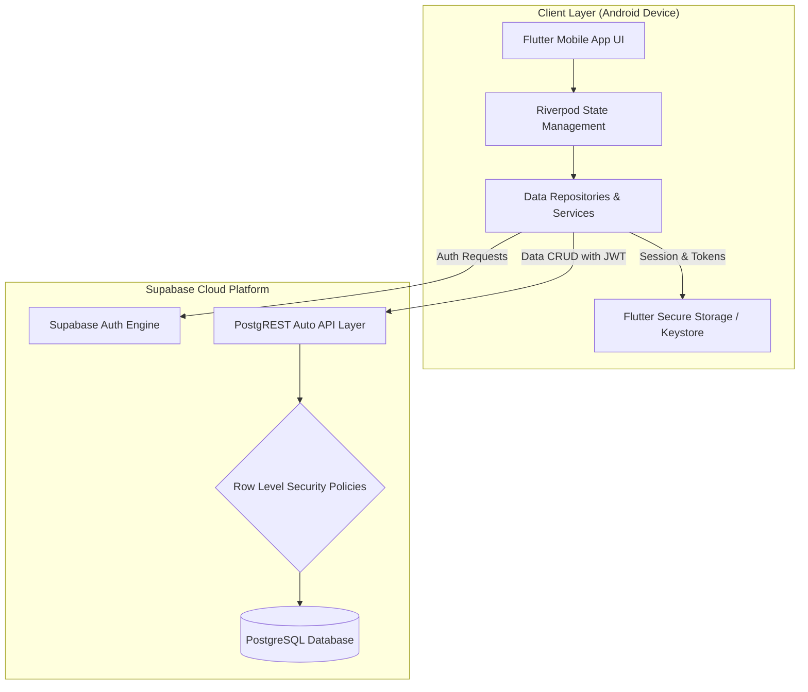
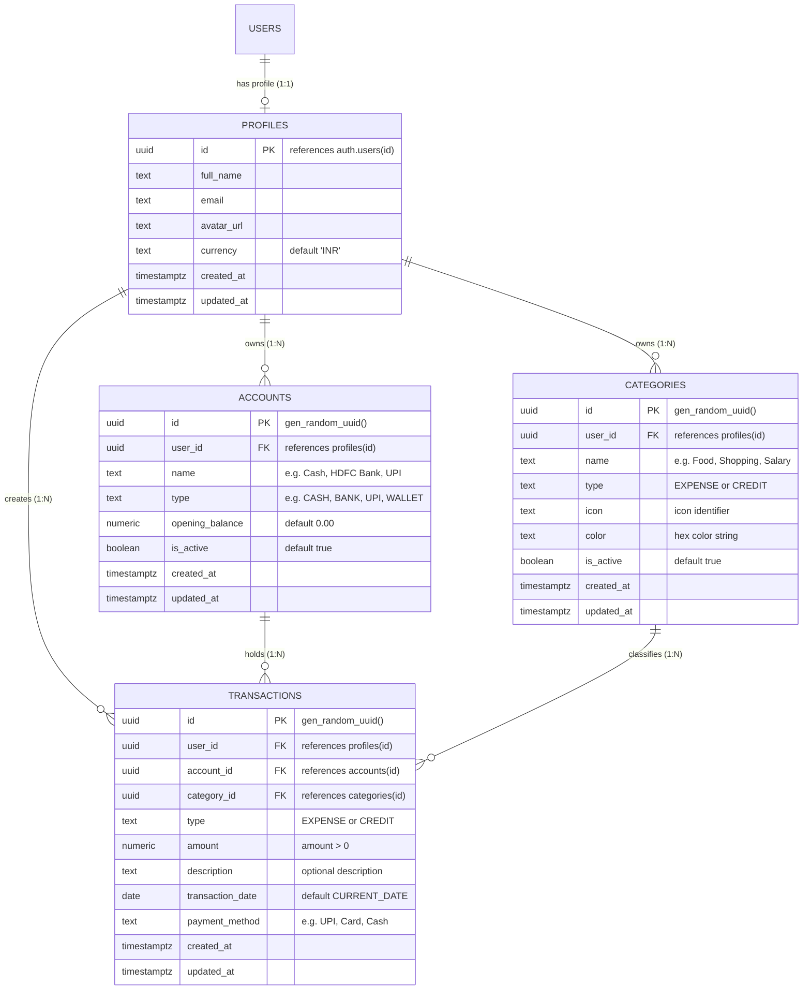
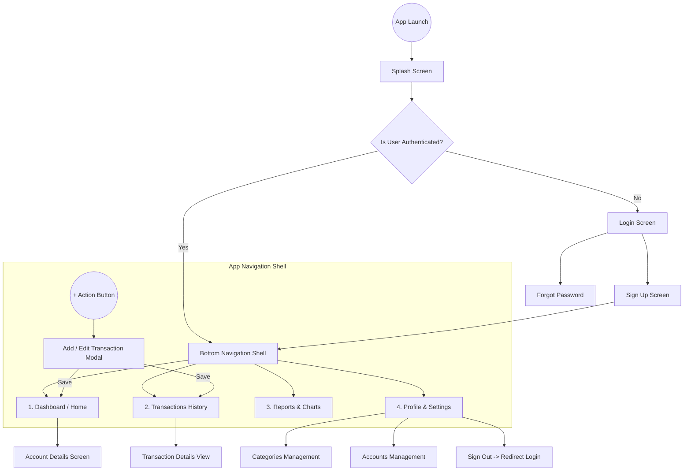

# System Architecture & Technical Design Document

**Project:** Personal Expense & Finance Management App  
**Target Platform:** Android (Google Play Store)  
**Frontend Framework:** Flutter 3.x (Dart 3.x)  
**Backend & Database:** Supabase (PostgreSQL 15+)  
**State Management:** Flutter Riverpod  
**Routing:** GoRouter  

---

## 1. High-Level System Architecture

The application adopts a modern, decoupled client-server architecture with strict backend authorization. The Flutter mobile app communicates directly with Supabase managed services using PostgreSQL Row Level Security (RLS) to enforce data privacy.



---

## 2. Frontend Layer Architecture (Feature-First)

The Flutter codebase follows a **Feature-Driven Clean Architecture** to ensure modularity, high testability, and separation of concerns.

### 2.1 Directory Structure
```text
lib/
├── app/
│   ├── app.dart                  # Main MaterialApp.router setup
│   ├── app_router.dart           # GoRouter declarative route definitions
│   └── app_theme.dart            # Modern Light/Dark theme tokens & typography
│
├── core/
│   ├── constants/                # App colors, layout metrics, string constants
│   ├── errors/                   # Failure classes & exception handlers
│   ├── network/                  # Supabase client singleton & connectivity listeners
│   ├── utils/                    # Currency formatters, date helpers, input validators
│   └── widgets/                  # Reusable atomic UI components (Buttons, Inputs, Cards)
│
└── features/
    ├── auth/                     # Authentication, onboarding & password reset
    │   ├── data/                 # Auth repository & Supabase data sources
    │   ├── domain/               # User model & auth validation logic
    │   └── presentation/         # Login, Register, Forgot Password screens & controllers
    │
    ├── dashboard/                # Home overview & metric cards
    │   ├── data/                 # Dashboard aggregation queries
    │   ├── domain/               # Dashboard summary metrics model
    │   └── presentation/         # Dashboard screen, balance card, quick action buttons
    │
    ├── transactions/             # Core income & expense management
    │   ├── data/                 # Transaction CRUD repository & query filters
    │   ├── domain/               # Transaction model & enums (Expense, Credit)
    │   └── presentation/         # Add/Edit form, transaction list, filter drawer
    │
    ├── accounts/                 # Payment source management (Cash, Bank, UPI)
    │   ├── data/                 # Accounts repository
    │   ├── domain/               # Account model & types
    │   └── presentation/         # Account list, add account modal, transfer logic
    │
    ├── categories/               # Expense/Credit category classification
    │   ├── data/                 # Categories repository & icon mappings
    │   ├── domain/               # Category model & icon/color metadata
    │   └── presentation/         # Category picker, custom category creator
    │
    ├── reports/                  # Spending analytics & visualizations
    │   ├── data/                 # Reporting queries & time-series aggregations
    │   ├── domain/               # Chart data models
    │   └── presentation/         # fl_chart donut/bar charts & date-range selector
    │
    └── profile/                  # User settings & preferences
        ├── data/                 # Profile update repository
        ├── domain/               # Profile entity (currency, name, avatar)
        └── presentation/         # Profile screen, currency switcher, sign out dialog
```

### 2.2 Layer Responsibilities
1. **Presentation Layer**:
   - Widgets, Screens, Dialogs.
   - Riverpod `StateNotifierProvider` or `@riverpod` AsyncNotifiers managing UI state and exposing immutable state objects.
2. **Domain Layer**:
   - Pure Dart Entities and Data Models with `@immutable` properties.
   - Business calculation logic (e.g. balance equations, month-over-month comparisons).
3. **Data Layer**:
   - Repositories interfacing with `supabase_flutter`.
   - Data Transfer Objects (DTOs) with `fromJson` / `toJson` serializations.

---

## 3. Database Architecture & ER Diagram

The database runs on PostgreSQL 15+ within Supabase. Relational integrity is enforced using foreign keys with cascading actions where appropriate.



---

## 4. Financial Calculation Engine

All balance calculations follow double-entry consistency principles:

### 4.1 Balance Formula
$$\text{Current Balance} = \sum (\text{Account Opening Balances}) + \sum (\text{Total Credits}) - \sum (\text{Total Expenses})$$

### 4.2 Account-Specific Balance
$$\text{Account Balance} = \text{Account Opening Balance} + \sum (\text{Credits on Account}) - \sum (\text{Expenses on Account})$$

### 4.3 Aggregations & Metrics
- **Current Month Expenses**: $\sum \text{Amount}$ where $\text{type} = \text{'EXPENSE'}$ and $\text{transaction\_date} \in [\text{Month Start}, \text{Month End}]$
- **Current Month Income**: $\sum \text{Amount}$ where $\text{type} = \text{'CREDIT'}$ and $\text{transaction\_date} \in [\text{Month Start}, \text{Month End}]$
- **Category Breakdown**: $\sum \text{Amount}$ grouped by `category_id` over the selected timeframe.

---

## 5. Navigation & Screen Flow



---

## 6. Technology Stack & Key Libraries

| Component | Technology / Package | Purpose |
|---|---|---|
| **Language** | Dart 3.13+ | Strongly-typed client code execution |
| **Framework** | Flutter 3.47+ (Android Engine) | Cross-platform UI toolkit targeting Android |
| **Backend & DB** | Supabase (PostgreSQL 15) | Relational database, REST API, triggers, & RLS |
| **Authentication** | Supabase Auth (`gotrue`) | Email/password auth, JWT sessions, refresh tokens |
| **State Management** | `flutter_riverpod` | Reactive state propagation, dependency injection |
| **Navigation** | `go_router` | Declarative URL-like routing with reactive auth guards |
| **Data Visualization** | `fl_chart` | Interactive donut, bar, and line financial charts |
| **Secure Storage** | `flutter_secure_storage` | Hardware-backed keystore token persistence |
| **Formatting** | `intl` | Multi-currency formatting, localized dates |
| **Design / Icons** | `google_fonts`, `lucide_icons` | Premium typography and iconography |
