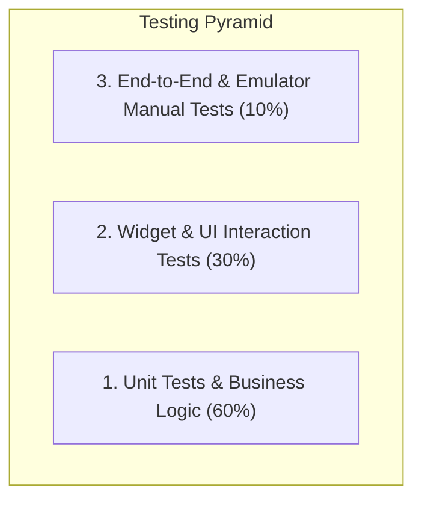

# Development Rules, Implementation Guidelines & Testing Strategy

**Project:** Personal Expense & Finance Management App  
**Target:** Flutter / Android (Google Play Store)  
**Backend:** Supabase PostgreSQL + Auth + RLS  

---

## 1. Core Implementation Principles ("How We Will Implement")

### 1.1 Architecture & Code Structure Rules
1. **Feature-First Organization**:
   - All feature-related code MUST live inside `lib/features/<feature_name>/` subdivided into `presentation/`, `domain/`, and `data/`.
   - Shared generic code (colors, formatters, reusable atomic UI, environment config) MUST live strictly under `lib/core/` and app-wide shell/routing under `lib/app/`.
2. **Separation of Concerns**:
   - **Widgets (UI)**: Responsible solely for rendering and handling user interactions. No direct SQL/Supabase calls in UI widgets.
   - **Providers/Controllers (Riverpod)**: Manage UI state (`AsyncNotifier`, `Notifier`) and interact with repositories.
   - **Repositories**: Encapsulate all communication with the Supabase client and map database rows/exceptions to domain models/failures.
   - **Models**: Immutable Dart domain objects with strict type definitions (`fromJson`, `toJson`, `copyWith`).

### 1.2 State Management Rules (Riverpod)
- Use `AsyncNotifier` for mutation controllers (e.g. `AuthController`, `TransactionController`) with `AsyncValue.guard()`.
- Use `StreamProvider` for continuous real-time event streams (e.g. `authStateProvider`).
- Always handle all 3 states for async data: `AsyncData`, `AsyncLoading`, and `AsyncError`.
- Keep providers scoped and dispose of unnecessary resources automatically where appropriate.

### 1.3 Routing & Navigation Rules (GoRouter)
- All navigation routing MUST be defined declaratively in `lib/app/router.dart` and exposed via `routerProvider`.
- Route protection is reactive: `GoRouter.redirect` checks `authStateProvider` to redirect unauthenticated users to `/login` and authenticated users away from public auth pages to `/` (Dashboard).
- The tab shell uses `StatefulShellRoute.indexedStack` to preserve navigation state across branches.
- Top-level modal forms (such as `/add-transaction`) must use `parentNavigatorKey: _rootNavigatorKey` with `fullscreenDialog: true`.

### 1.4 UI & Design Consistency Rules
- **No Hardcoded Values**:
  - Never hardcode colors, padding, or text styles inside individual widgets. Use `AppColors`, `AppTypography`, and `Theme.of(context).textTheme`.
- **Income vs. Expense Semantics**:
  - Always render Income/Credit in **Green** (`AppColors.credit` / `#10B981`) with a `+` sign.
  - Always render Expense in **Red/Coral** (`AppColors.expense` / `#EF4444`) with a `-` sign.
- **Responsiveness & Ergonomics**:
  - Big numeric inputs for transaction amounts with built-in currency symbol prefix (e.g. `₹`).
  - Form fields must have immediate, clear validation feedback.

### 1.5 Error Handling & Network Resilience
- Every Supabase call MUST be wrapped in a try/catch or `AsyncValue.guard` block mapping exceptions to user-friendly messages.
- Network connection failures MUST display non-blocking user feedback (e.g., `ScaffoldMessenger` / Custom SnackBar) without crashing the app.

---

## 1.6 Database Migration Policy 🗃️ (MANDATORY)

> **GOLDEN RULE: Any change to the Supabase database schema MUST be expressed as a numbered SQL migration file. Direct edits to the cloud console are strictly prohibited.**

### When to Create a Migration
You MUST create a new migration file when any of the following occur:
- Adding, dropping, or renaming a column on any table
- Adding or removing a table or view
- Changing constraints (`CHECK`, `UNIQUE`, `NOT NULL`, default values)
- Adding or removing indexes
- Adding or modifying RLS policies or triggers
- Changing function definitions (`CREATE OR REPLACE FUNCTION`)
- Adding or modifying seed data that must be reproducible

### Migration Workflow (Step-by-Step)
```bash
# 1. Create a new numbered migration file via npm
npm run db:new -- <descriptive_name>
# e.g: npm run db:new -- 003_add_tags_to_transactions
# → Creates: supabase/migrations/<timestamp>_003_add_tags_to_transactions.sql

# 2. Write the SQL in the generated file
# Use ADD COLUMN IF NOT EXISTS, CREATE TABLE IF NOT EXISTS, etc.

# 3. Dry-run to validate (no changes applied)
npm run db:push:dry

# 4. Apply to remote Supabase
npm run db:push

# 5. Verify sync status
npm run db:status
# Expected: { "local": "003", "remote": "003" }
```

### Migration File Naming Convention
```
supabase/migrations/
├── 001_initial_schema.sql                                  ← Original schema (applied)
├── 20260920173737_002_accounts_icon_color.sql             ← CLI-generated (applied)
└── <timestamp>_NNN_<snake_case_description>.sql           ← Future migrations
```

### SQL Safety Rules Inside Migrations
| Operation | Required pattern |
|---|---|
| Add column | `ALTER TABLE t ADD COLUMN IF NOT EXISTS col TYPE DEFAULT val;` |
| Create table | `CREATE TABLE IF NOT EXISTS ...` |
| Create index | `CREATE INDEX IF NOT EXISTS ...` |
| Create/replace function | `CREATE OR REPLACE FUNCTION ...` |
| Drop trigger | `DROP TRIGGER IF EXISTS ...` before re-creating |
| Never | Raw `DROP TABLE`, `DROP COLUMN` without `IF EXISTS` |

### After Every Migration
- [ ] Run `flutter analyze` — must return 0 issues
- [ ] Run `flutter test` — must maintain all tests passing
- [ ] Update `docs/memory.md` changelog with the migration entry
- [ ] Update `docs/phase.md` if the migration unblocks a milestone task

### Model / Repository Sync Rule
Whenever a column is added to the DB:
1. Add the field to the domain model (`fromMap`, `toMap`, `copyWith`)
2. Update the repository insert/update methods
3. Add a serialization test verifying the new column is read and written correctly

---

## 2. Feature Boundaries ("What We Will Implement")

### 2.1 In-Scope for MVP (Strictly Enforced)
- [x] **Authentication**: Email/Password Sign-up, Login, Logout, Forgot Password, reactive routing guards.
- [ ] **Dashboard**: Total Balance card, Monthly Income & Expense breakdown, Recent Transactions list.
- [ ] **Expense Management**: Add, edit, delete expense with category, date, account, and description.
- [ ] **Credit (Income) Management**: Add, edit, delete credit with source, date, account, and description.
- [ ] **Transaction History**: Filter by date/month, type (Credit/Expense), category, account, and live search.
- [ ] **Accounts / Payment Sources**: Manage Cash, Bank, UPI, Savings, Wallet.
- [ ] **Categories**: Default categories (Food, Travel, Bills, Rent, Salary, Freelance, etc.) and custom category creation.
- [ ] **Visual Reports**: Category spending distribution donut chart (`fl_chart`), monthly trends.
- [ ] **Data Isolation**: Supabase PostgreSQL Row Level Security (RLS) guaranteeing 100% cross-user privacy.

### 2.2 Strictly Out-of-Scope for Initial Release (Do NOT Implement in v1)
- ❌ OCR receipt scanning & camera image attachments.
- ❌ SMS automatic parser / auto-read OTP.
- ❌ Multi-currency live conversion APIs.
- ❌ Shared/Family group budgets.
- ❌ Direct bank integration (Plaid / Account Aggregator).

---

## 3. Testing Strategy ("What to Test & How to Test")

### 3.1 Testing Matrix



### 3.2 What to Test (Test Requirements)

#### A. Unit Tests (`test/unit/` & `test/features/`)
1. **Auth & Domain Models**:
   - `AuthUser` domain mapping and email confirmation verification.
   - `UserProfile`, `AccountModel`, `CategoryModel`, `TransactionModel` JSON serialization/deserialization.
2. **Financial Calculations**:
   - `Current Balance = Opening Balance + Total Credits - Total Expenses`.
   - Handling zero balance, negative net cash flow, floating point decimal accuracy.
3. **Formatters & Parsers**:
   - Currency formatters (e.g., Indian numbering system `₹1,50,000.00` and international `$1,500.00`).
   - Date formatters (e.g., "Today", "Yesterday", "19 Sep 2026").

#### B. Security & RLS Tests (`test/security/` / Supabase SQL Migrations)
1. **Multi-User Isolation**:
   - Attempt `SELECT * FROM transactions` as User A $\rightarrow$ Must ONLY return User A transactions.
   - Attempt `UPDATE transactions SET amount = 100 WHERE id = <User B's txn>` as User A $\rightarrow$ Must affect 0 rows.
2. **Constraint Enforcement**:
   - Attempt inserting transaction with `amount = -50` $\rightarrow$ Must throw check constraint violation.
   - Attempt inserting transaction with invalid `type = 'INVALID'` $\rightarrow$ Must throw check constraint violation.

#### C. Widget & Form Tests (`test/widget/` / `test/widget_test.dart`)
1. **Auth & Routing Tests**:
   - Verify unauthenticated user lands on Login screen (`/login`).
   - Verify authenticated user loads bottom navigation shell with Dashboard (`/`).
2. **Forms & Input Validation**:
   - Validates that amount is non-empty and greater than 0.
   - Toggling between Expense and Credit updates category selector dynamically.
   - Form submission calls repository and dismisses the modal on success.
   - Email format and password strength validation.

#### D. Manual Verification on Android Emulator
1. **Device**: Pixel 7 (API 36, `emulator-5554`).
2. **Verification Scenarios**:
   - Cold launch & splash screen transition.
   - Sign up a new user $\rightarrow$ Verify default categories and Cash account auto-populate via Supabase trigger.
   - Add expenses and income $\rightarrow$ Verify dashboard balance and monthly totals update instantly.
   - Test screen rotation, keyboard open/close, and dark/light theme switching.

---

## 4. Execution Workflow & Quality Checklist

Before marking any phase or task as complete:
1. `flutter analyze` must produce **0 errors and 0 warnings**.
2. All unit and widget tests must pass (`flutter test`).
3. Changes must be recorded in [docs/memory.md](file:///c:/src/expense_tracker/docs/memory.md).
4. Any modified phase checkboxes must be updated in [docs/phase.md](file:///c:/src/expense_tracker/docs/phase.md).
