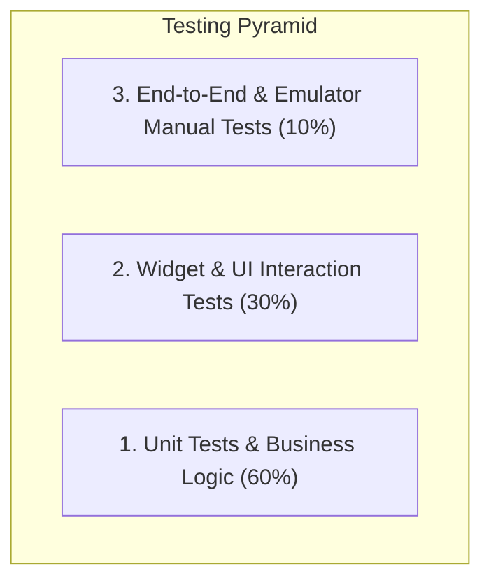

# Development Rules, Implementation Guidelines & Testing Strategy

**Project:** Personal Expense & Finance Management App  
**Target:** Flutter / Android (Google Play Store)  
**Backend:** Supabase PostgreSQL + Auth + RLS  

---

## 1. Core Implementation Principles ("How We Will Implement")

### 1.1 Architecture & Code Structure Rules
1. **Feature-First Organization**:
   - All feature-related code MUST live inside `lib/features/<feature_name>/` subdivided into `presentation/`, `domain/`, and `data/`.
   - Shared generic code (colors, formatters, reusable atomic UI) MUST live strictly under `lib/core/`.
2. **Separation of Concerns**:
   - **Widgets (UI)**: Responsible solely for rendering and handling user interactions. No direct SQL/Supabase calls in UI widgets.
   - **Providers/Controllers (Riverpod)**: Manage UI state and interact with repositories.
   - **Repositories**: Encapsulate all communication with the Supabase client.
   - **Models**: Immutable Dart objects with strict type definitions (`fromJson`, `toJson`, `copyWith`).

### 1.2 State Management Rules (Riverpod)
- Use `@riverpod` code generation or `Notifier` / `AsyncNotifier` for complex state.
- Always handle all 3 states for async data: `AsyncData`, `AsyncLoading`, and `AsyncError`.
- Keep providers scoped and dispose of unnecessary resources automatically (`autoDispose`).

### 1.3 UI & Design Consistency Rules
- **No Hardcoded Values**:
  - Never hardcode colors, padding, or text styles inside individual widgets. Use `AppColors`, `AppSpacing`, and `Theme.of(context).textTheme`.
- **Income vs. Expense Semantics**:
  - Always render Income/Credit in **Green** (`AppColors.credit` / `#10B981`) with a `+` sign.
  - Always render Expense in **Red/Coral** (`AppColors.expense` / `#EF4444`) with a `-` sign.
- **Responsiveness & Ergonomics**:
  - Big numeric inputs for transaction amounts with built-in currency symbol prefix (e.g. `₹`).
  - Form fields must have immediate, clear validation feedback.

### 1.4 Error Handling & Network Resilience
- Every Supabase call MUST be wrapped in a try/catch block mapping exceptions to standardized `Failure` domain objects.
- Network connection failures MUST display non-blocking user feedback (e.g., `ScaffoldMessenger` / Custom Toast) without crashing the app.

---

## 2. Feature Boundaries ("What We Will Implement")

### 2.1 In-Scope for MVP (Strictly Enforced)
- [x] **Authentication**: Email/Password Sign-up, Login, Logout, Forgot Password.
- [x] **Dashboard**: Total Balance card, Monthly Income & Expense breakdown, Recent Transactions list.
- [x] **Expense Management**: Add, edit, delete expense with category, date, account, and description.
- [x] **Credit (Income) Management**: Add, edit, delete credit with source, date, account, and description.
- [x] **Transaction History**: Filter by date/month, type (Credit/Expense), category, account, and live search.
- [x] **Accounts / Payment Sources**: Manage Cash, Bank, UPI, Savings, Wallet.
- [x] **Categories**: Default categories (Food, Travel, Bills, Rent, Salary, Freelance, etc.) and custom category creation.
- [x] **Visual Reports**: Category spending distribution donut chart (`fl_chart`), monthly trends.
- [x] **Data Isolation**: Supabase PostgreSQL Row Level Security (RLS) guaranteeing 100% cross-user privacy.

### 2.2 Strictly Out-of-Scope for Initial Release (Do NOT Implement in v1)
- ❌ OCR receipt scanning & camera image attachments.
- ❌ SMS automatic parser / auto-read OTP.
- ❌ Multi-currency live conversion APIs.
- ❌ Shared/Family group budgets.
- ❌ Direct bank integration (Plaid / Account Aggregator).

---

## 3. Testing Strategy ("What to Test & How to Test")

### 3.1 Testing Matrix

### 3.2 What to Test (Test Requirements)

#### A. Unit Tests (`test/unit/`)
1. **Financial Calculations**:
   - `Current Balance = Opening Balance + Total Credits - Total Expenses`.
   - Handling zero balance, negative net cash flow, floating point decimal accuracy.
2. **Formatters & Parsers**:
   - Currency formatters (e.g., Indian numbering system `₹1,50,000.00` and international `$1,500.00`).
   - Date formatters (e.g., "Today", "Yesterday", "19 Sep 2026").
3. **Data Serialization**:
   - `TransactionModel.fromJson()` and `toJson()` mapping verification.
   - Null-safety checks on optional fields (e.g., description, notes).

#### B. Security & RLS Tests (`test/security/` / Supabase SQL Tests)
1. **Multi-User Isolation**:
   - Attempt `SELECT * FROM transactions` as User A $\rightarrow$ Must ONLY return User A transactions.
   - Attempt `UPDATE transactions SET amount = 100 WHERE id = <User B's txn>` as User A $\rightarrow$ Must affect 0 rows.
2. **Constraint Enforcement**:
   - Attempt inserting transaction with `amount = -50` $\rightarrow$ Must throw check constraint violation.
   - Attempt inserting transaction with invalid `type = 'INVALID'` $\rightarrow$ Must throw check constraint violation.

#### C. Widget & Form Tests (`test/widget/`)
1. **Add Transaction Form**:
   - Validates that amount is non-empty and greater than 0.
   - Toggling between Expense and Credit updates category selector dynamically.
   - Form submission calls repository and dismisses the modal on success.
2. **Auth Forms**:
   - Email format validation (`name@domain.com`).
   - Password strength validation (min 6 characters).

#### D. Manual Verification on Android Emulator
1. **Device**: Pixel 7 (API 36, `emulator-5554`).
2. **Verification Scenarios**:
   - Cold launch & splash screen transition.
   - Sign up a new user $\rightarrow$ Verify default categories and Cash account auto-populate.
   - Add 3 expenses and 1 income $\rightarrow$ Verify dashboard balance and monthly totals update instantly.
   - Test screen rotation, keyboard open/close, and dark/light theme switching.

---

## 4. Execution Workflow & Quality Checklist

Before marking any phase or task as complete:
1. `flutter analyze` must produce **0 errors and 0 warnings**.
2. All unit and widget tests must pass (`flutter test`).
3. Changes must be recorded in [docs/memory.md](file:///c:/src/expense_tracker/docs/memory.md).
4. Any modified phase checkboxes must be updated in [docs/phase.md](file:///c:/src/expense_tracker/docs/phase.md).
