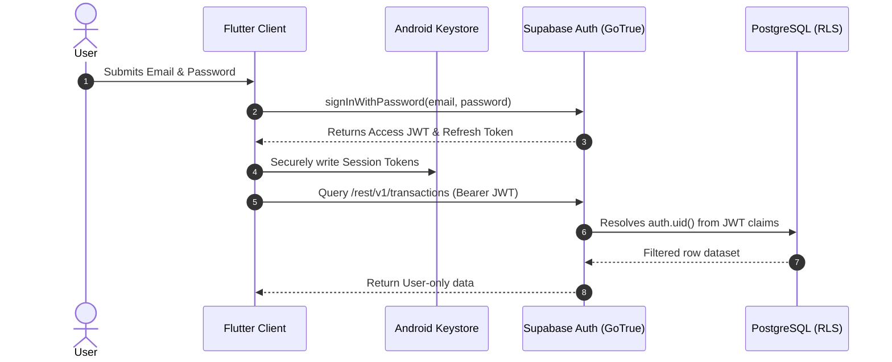

# Security & Data Governance Architecture

**Project:** Personal Expense & Finance Management App  
**Scope:** Client-Side Security, Backend Access Control, Row Level Security (RLS), & Data Protection  

---

## 1. Security Philosophy & Principles

Personal finance management requires enterprise-grade security standards. The system enforces four fundamental security pillars:

1. **Zero-Trust Client Boundary**: The client application is treated as an untrusted environment. Security rules are never purely client-side; authorization must be strictly enforced at the database level.
2. **Strict Multi-Tenant Isolation**: Complete row-level isolation between users. User $A$ cannot under any circumstance read, query, insert, or alter User $B$'s financial records.
3. **Principle of Least Privilege**: The mobile app only receives and transmits the public Anonymous Key (`anon_key`) and user JWTs. The elevated `service_role` key is strictly forbidden from inclusion in client source code.
4. **Defense in Depth**: End-to-end transport layer security (TLS 1.3), hardware-backed credential storage on Android, and relational foreign key constraints.

---

## 2. PostgreSQL Row Level Security (RLS) Specification

All tables containing user financial data have Row Level Security explicitly **ENABLED**.
Hard `DELETE` permissions are intentionally **not granted** to authenticated client roles; deletion is performed strictly through soft-delete (`UPDATE ... SET deleted_at = NOW()`).

### 2.1 `profiles` Security Policy (Owner: `id = auth.uid()`)
```sql
ALTER TABLE public.profiles ENABLE ROW LEVEL SECURITY;

CREATE POLICY "profiles_select_own" ON public.profiles
    FOR SELECT TO authenticated
    USING (auth.uid() = id AND deleted_at IS NULL);

CREATE POLICY "profiles_insert_own" ON public.profiles
    FOR INSERT TO authenticated
    WITH CHECK (auth.uid() = id);

CREATE POLICY "profiles_update_own" ON public.profiles
    FOR UPDATE TO authenticated
    USING (auth.uid() = id)
    WITH CHECK (auth.uid() = id);
```

### 2.2 `accounts` Security Policy (Owner: `user_id = auth.uid()`)
```sql
ALTER TABLE public.accounts ENABLE ROW LEVEL SECURITY;

CREATE POLICY "accounts_select_own" ON public.accounts
    FOR SELECT TO authenticated
    USING (auth.uid() = user_id AND deleted_at IS NULL);

CREATE POLICY "accounts_insert_own" ON public.accounts
    FOR INSERT TO authenticated
    WITH CHECK (auth.uid() = user_id);

CREATE POLICY "accounts_update_own" ON public.accounts
    FOR UPDATE TO authenticated
    USING (auth.uid() = user_id)
    WITH CHECK (auth.uid() = user_id);
```

### 2.3 `categories` Security Policy (Owner: `user_id = auth.uid()`)
```sql
ALTER TABLE public.categories ENABLE ROW LEVEL SECURITY;

CREATE POLICY "categories_select_own" ON public.categories
    FOR SELECT TO authenticated
    USING (auth.uid() = user_id AND deleted_at IS NULL);

CREATE POLICY "categories_insert_own" ON public.categories
    FOR INSERT TO authenticated
    WITH CHECK (auth.uid() = user_id);

CREATE POLICY "categories_update_own" ON public.categories
    FOR UPDATE TO authenticated
    USING (auth.uid() = user_id)
    WITH CHECK (auth.uid() = user_id);
```

### 2.4 `transactions` Security Policy (Owner: `user_id = auth.uid()`)
```sql
ALTER TABLE public.transactions ENABLE ROW LEVEL SECURITY;

CREATE POLICY "transactions_select_own" ON public.transactions
    FOR SELECT TO authenticated
    USING (auth.uid() = user_id AND deleted_at IS NULL);

CREATE POLICY "transactions_insert_own" ON public.transactions
    FOR INSERT TO authenticated
    WITH CHECK (auth.uid() = user_id);

CREATE POLICY "transactions_update_own" ON public.transactions
    FOR UPDATE TO authenticated
    USING (auth.uid() = user_id)
    WITH CHECK (auth.uid() = user_id);
```

---

## 3. Database Constraints & Composite Integrity Safeguards

1. **Cross-User Ownership Protection (Composite Foreign Keys)**:
   - `accounts` enforces `UNIQUE(id, user_id)`.
   - `transactions` enforces `FOREIGN KEY (account_id, user_id) REFERENCES public.accounts(id, user_id)`: **Mathematically guarantees** that a user cannot attach a transaction to another user's account.
2. **Category Ownership & Type Matching (Composite Foreign Key)**:
   - `categories` enforces `UNIQUE(id, user_id, type)`.
   - `transactions` enforces `FOREIGN KEY (category_id, user_id, type) REFERENCES public.categories(id, user_id, type)`: **Mathematically guarantees** that an Expense transaction can ONLY link to an Expense category owned by the same user (and Credit to Credit).
3. **Strict Positive Amounts**:
   - `CHECK (amount > 0)`.
4. **Server-Managed Audit Immunity**:
   - `handle_base_audit_fields()` trigger strictly overrides `created_by`, `updated_by`, and `deleted_by` from `auth.uid()` and preserves `created_at`/`created_by` across updates.

---

## 4. Authentication & Token Management



### 4.1 Token Storage on Android
- Supabase SDK uses `flutter_secure_storage` which utilizes **Android KeyStore** and **EncryptedSharedPreferences** (AES-256 GCM encryption).
- Session tokens are auto-refreshed prior to expiration without requiring manual user re-authentication.

---

## 5. Threat Modeling & Mitigation Matrix

| Threat | Risk Level | Mitigation Strategy |
|---|---|---|
| **Cross-User Data Leakage (IDOR)** | **Critical** | Enforce PostgreSQL RLS (`auth.uid() = user_id`). Even if an attacker manually passes another user's transaction ID, PostgreSQL returns 0 rows. |
| **API Key Exposure / Decompilation** | **High** | Only the public `anon_key` is bundled into the client. The `anon_key` has zero permissions without a valid user JWT. The `service_role` key is never bundled. |
| **Tampered Transaction Amounts** | **High** | Database-level `CHECK (amount > 0)` constraint prevents negative expenses or fraudulent balance credits. |
| **Man-in-the-Middle (MitM)** | **Medium** | Enforce HTTPS / TLS 1.3 encryption across all network communication. |
| **Device Theft / Local Memory Dump** | **Medium** | Sensitive session credentials are saved using Android KeyStore-backed encrypted storage. |
| **SQL Injection** | **Low** | Supabase PostgREST uses prepared parameterized statements exclusively; raw SQL string interpolation is avoided. |

---

## 6. Pre-Production Security Checklist

- [ ] All 4 tables (`profiles`, `accounts`, `categories`, `transactions`) have RLS enabled.
- [ ] No table has public write or read access without `auth.uid()` verification.
- [ ] Supabase `service_role` secret is stored strictly in secure CI/CD environment variables and never present in Flutter source code.
- [ ] Proguard / R8 code obfuscation is enabled in `android/app/build.gradle` for release builds.
- [ ] Cross-tenant penetration test executed (attempt to access User A's data using User B's auth token).
